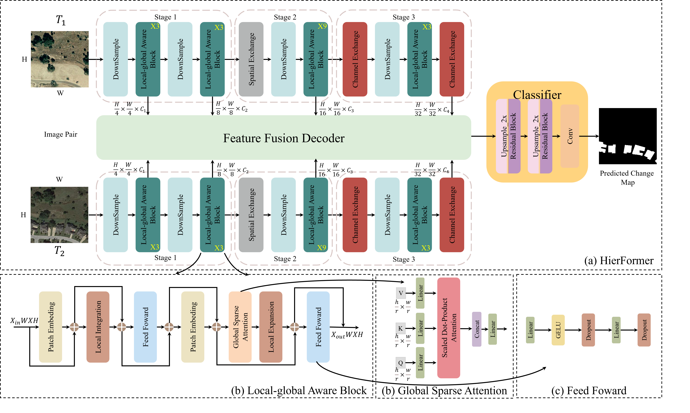

# A hierarchical local-global aware transformer with scratch learning capabilities for change detection
Here, we provide the pytorch implementation of the paper: A hierarchical local-global aware transformer with scratch learning capabilities for change detection 

For more ore information, please see our published paper at 
## Overall Architecture



## Requirements

```
torch==1.12.1+cu114
torchvision==0.13.1+cu114
```

will be updated soon

